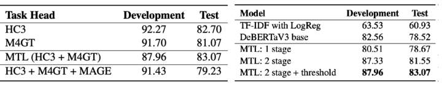
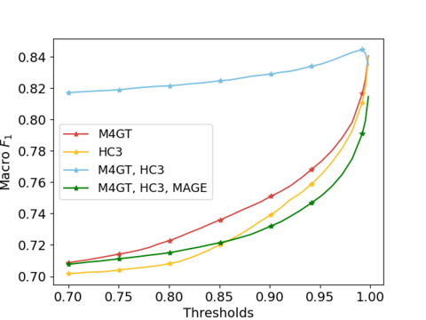

# Advacheck at GenAI Detection Task 1: Multi-Task Model For Binary Classification
<p align="center">
  <a href="https://arxiv.org/pdf/2411.11736"> 📃 Paper</a> |  
  <a href="gritsai@advacheck.com"> 📭 Contact 1</a> 
  <a href="voznyuk@advacheck.com"> 📭 Contact 2</a> 
</p>


## :mountain: Overview

Here we described a system designed by Advacheck team to recognise machine-generated and human-written texts in the monolingual subtask of [GenAI Detection Task 1](https://github.com/mbzuai-nlp/COLING-2025-Workshop-on-MGT-Detection-Task1/tree/main) competition. Our developed system is a multi-task architecture with shared Transformer Encoder between several classification heads. One head is responsible for binary classification between human-written and machine-generated texts, while the other heads are auxiliary multiclass classifiers for texts of different domains from particular datasets. As multiclass heads were trained to distinguish the domains presented in the data, they provide a better understanding of the samples. This approach led us to achieve the **first place** in the official ranking with **83.07%** macro F1-score on the test set and bypass the baseline by 10%. We further study obtained system through ablation, error and representation analyses, finding that multi-task learning outperforms single-task mode and simultaneous tasks form a cluster structure in embeddings space.

## Quick Start
We have published our trained model that was used in a competition on 🤗 [HuggingFace](https://huggingface.co/OU-Advacheck/deberta-v3-base-daigenc-mgt1a). Here is the fastest way to run this model for binary detection of machine-generated samples:

```python
import torch
from transformers import AutoTokenizer, DebertaV2ForSequenceClassification

class MLayerDebertaV2ForSequenceClassification(
    DebertaV2ForSequenceClassification
):
    def __init__(self, config, **kwargs):
        super().__init__(config)
        self.classifier = torch.nn.Sequential(
            torch.nn.Linear(config.hidden_size, 512),
            torch.nn.GELU(),
            torch.nn.Linear(512, 256),
            torch.nn.GELU(),
            torch.nn.Dropout(0.5),
            torch.nn.Linear(256, 2)
        )

tokenizer = AutoTokenizer.from_pretrained("OU-Advacheck/deberta-v3-base-daigenc-mgt1a")
model = MLayerDebertaV2ForSequenceClassification.from_pretrained("OU-Advacheck/deberta-v3-base-daigenc-mgt1a")
model.eval()

inputs = tokenizer(
    ['Hello, Thanks for sharing your health concern with us.'], max_length=512, truncation=True, padding="max_length", return_tensors="pt"
)

torch.softmax(model(**inputs)[0], dim=1).detach().cpu()[:, 1].tolist()
```
 
The last command will output the probabilities of two classes predicted by the model. While working on the problem, it was noticed that using `torch.argmax` is not always optimal and it is better to select a threshold on a delayed sample. More details about this in the [Threshold](#ThresholdIssue) section.

## Train Your Own Model

We also provide the possibility to train your own model using the implemented module. Parallel learning heads are selected for training and then two fine-tuning stages are performed.

### Install depedencies
```bash
cd ai-detector-coling2025
pip install -r requirements.txt
```

### Preprocess data
This is where the data is generated in the required format and the number of heads is selected from the submitted competition data. By *default*, three classification heads are used, which allowed us to achieve the best result.
```bash
python3 scripts/preprocess.py --classification_heads full_data hc3 m4gt
```

### Run training --- 1 stage
The described approach consists of two stages. In the first stage the whole model is frozen and only the classifier is trained. It is recommended to set hyperparameters in `train_config.yaml` in accordance with those specified in the article.
```python
python3 scripts/train_model.py \
        --config config/train_config.yaml
```

### Run training --- 2 stage
As a result of the first stage several model checkpoints will be available, the best of which should be set in the `model_checkpoint` field in the config file.

`🚨 Reminder:` Don't forget to change model_checkpoint, stage and hyperparams to those required in stage two.
```python
python3 scripts/train_model.py \
        --config config/train_config.yaml
```

### Run inference
We have provided an inference code that uses the dev part of the dataset from the competition as an example. It can be used to evaluate the quality of the resulting model.
```python
python3 scripts/run_inference.py \
        --model_checkpoint src/training/model_checkpoints/checkpoint-3000/
```

## Metrics
The model with multi-task learning architecture helped us to achieve a high value of the target metric in the posed competition. In the graphs below, we have compared different configurations of our system with changing simultaneous trained heads (figure on the left), as well as the impact of multiple training stages and classification thresholds (figure on the right).



## Threshold Issue
The classification threshold was crucial in the final system. We performed the selection on several samples and settled on the value `threshold=0.92`. However, if we look at the threshold testing on the dev subsample of the competition, we can see that this may not be the most optimal threshold.



## Citation
```
@misc{gritsai2024advacheckgenaidetectiontask,
      title={Advacheck at GenAI Detection Task 1: AI Detection Powered by Domain-Aware Multi-Tasking}, 
      author={German Gritsai and Anastasia Voznyuk and Ildar Khabutdinov and Andrey Grabovoy},
      year={2024},
      eprint={2411.11736},
      archivePrefix={arXiv},
      primaryClass={cs.CL},
      url={https://arxiv.org/abs/2411.11736}, 
}
```

Also recommend: [Great overview of Multi-Task Architecture](https://medium.com/@shahrukhx01/multi-task-learning-with-transformers-part-1-multi-prediction-heads-b7001cf014bf)